Developer Environment Setup
1. Install Windows 11
Visit the Windows 11 download page
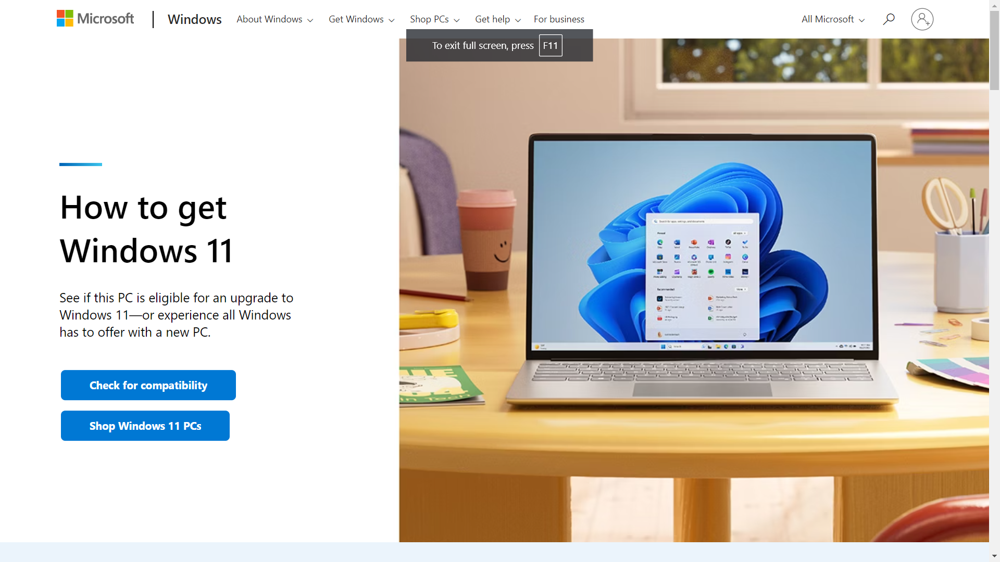
Download the installation media or upgrade tool

Run the tool and follow the instructions to install or upgrade to Windows 11

2. Install Visual Studio Code
Visit the Visual Studio Code download page
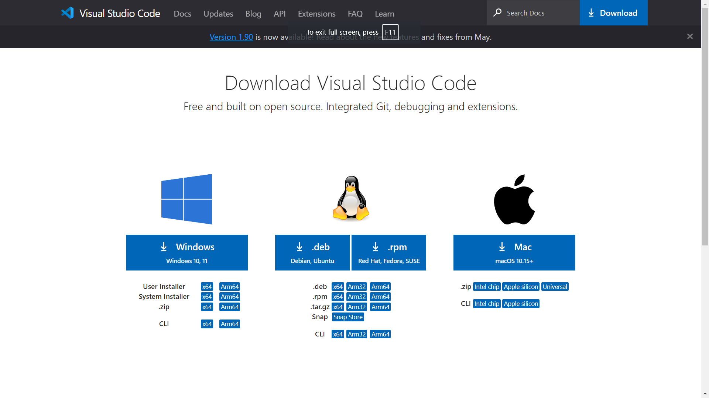
Download the installer for Windows and run it
Follow the on-screen instructions to complete the installation
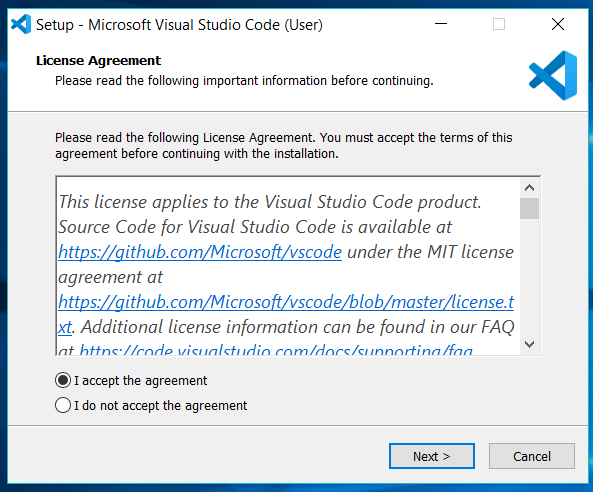

3. Set Up Version Control System (Git)
Visit the Git download page
Download and run the installer
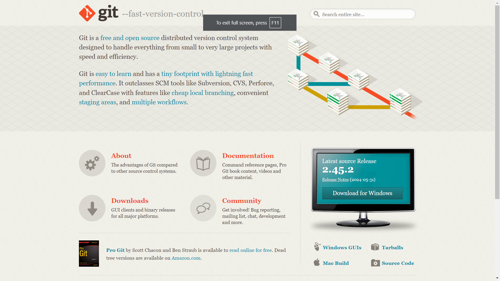

Open Git Bash and configure Git:
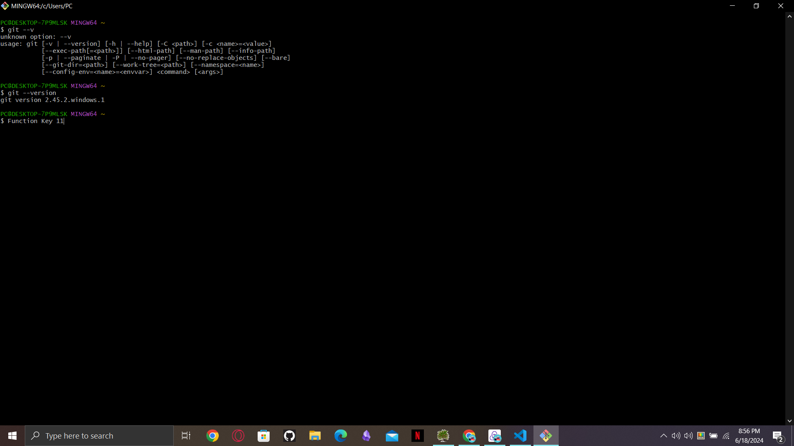

Create a GitHub account at GitHub
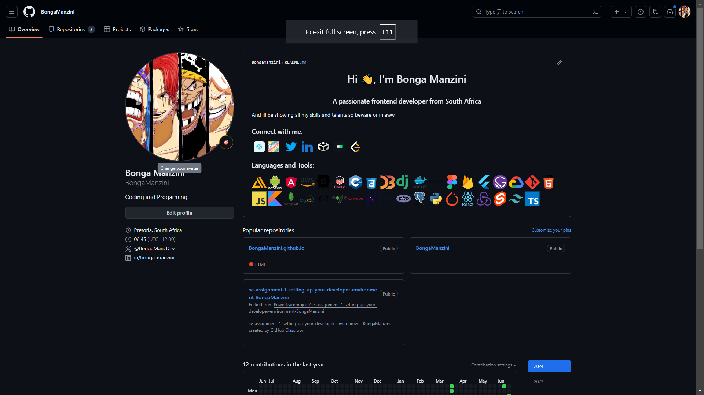

4. Install Python
Visit the Python download page
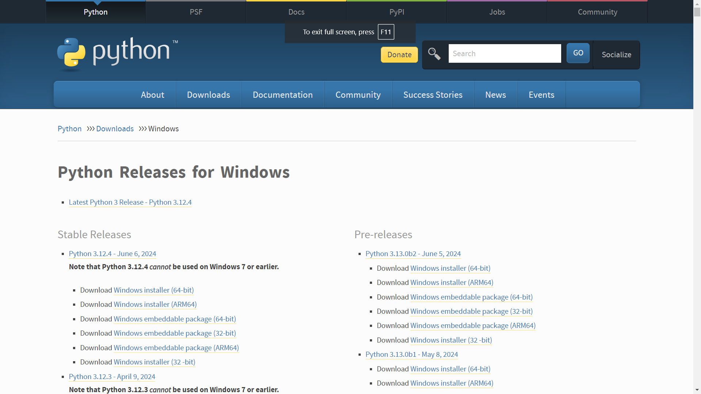
Download and run the installer, ensuring "Add Python to PATH" is checked
Verify the installation:
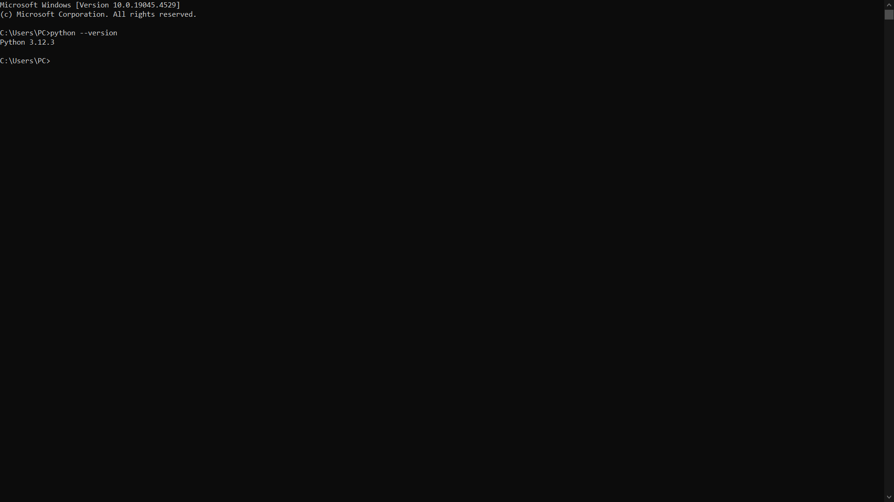

5. Install Package Managers
Pip is included with Python. 
Verify pip installation:
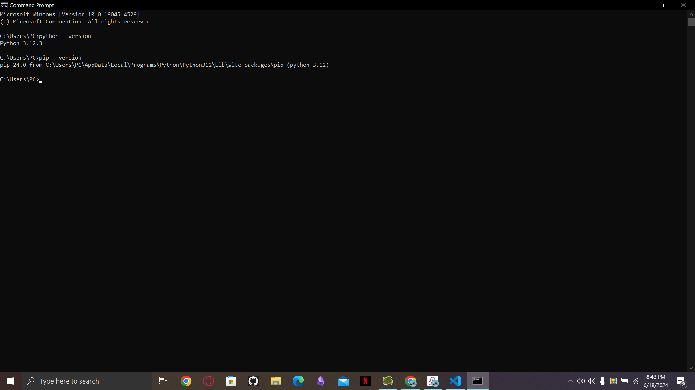

6. Configure MySQL Database
Visit the MySQL Installer download page
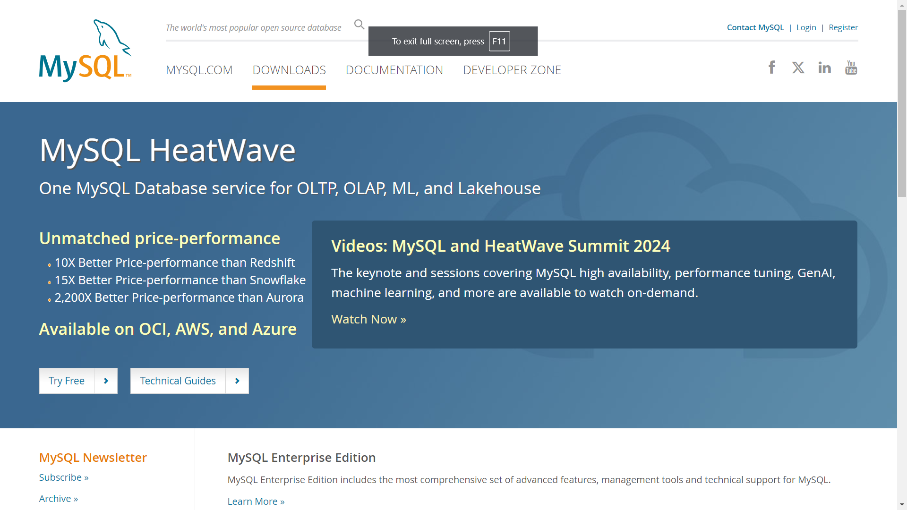
Download and run the installer
Follow the on-screen instructions to install and configure MySQL Server and Workbench
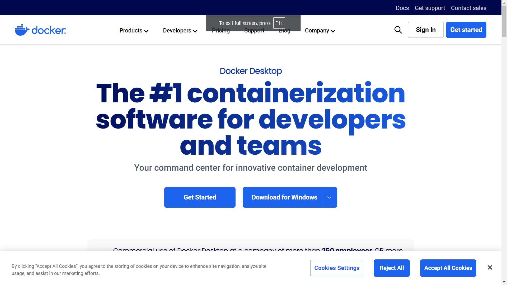
7. Set Up Development Environments and Virtualization (Optional)
Download and install Docker from the Docker website

Verify the installation:
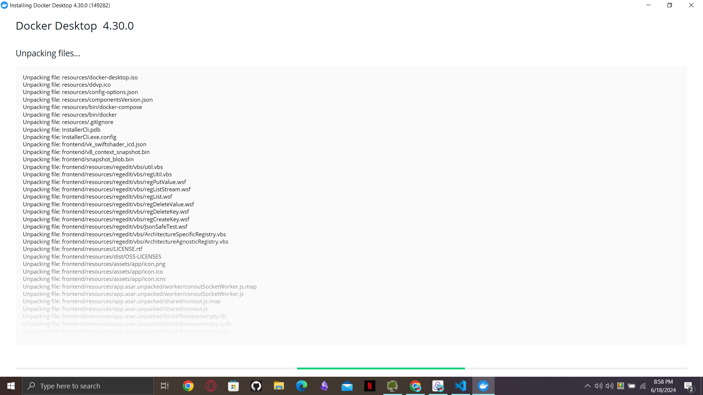
8. Explore Extensions and Plugins for VS Code
Open Visual Studio Code
Go to Extensions view and search for:
Python (by Microsoft)
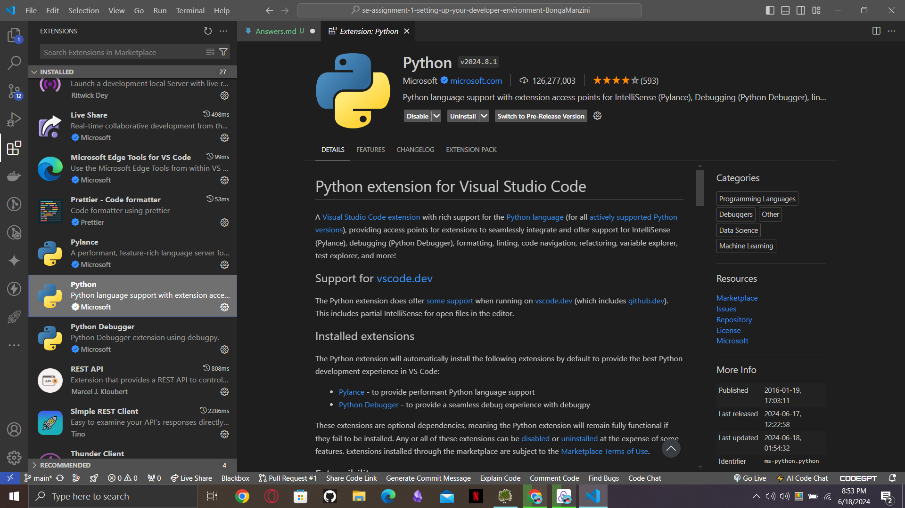
GitLens (by GitKraken)
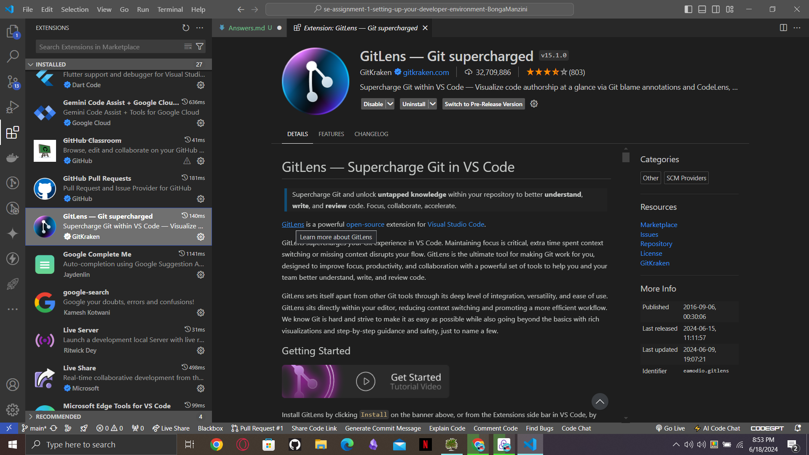
Docker (by Microsoft)
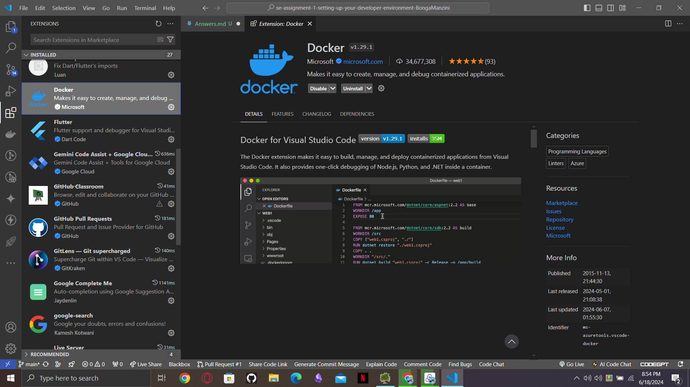

